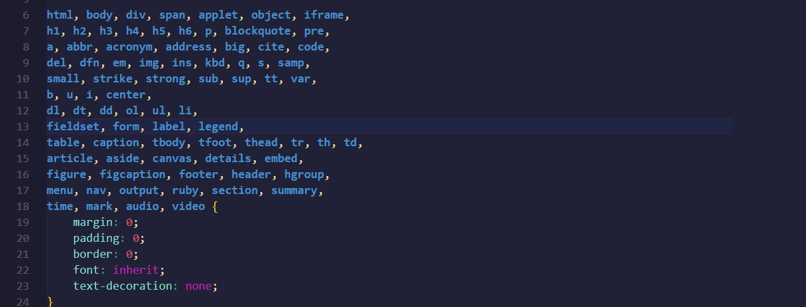

Na Alura, faço parte da equipe do Apoio Educacional e em meio a várias dúvidas que surgem no Fórum, algumas são direcionadas à prática do *reset CSS*. Aqui, vamos juntos entender melhor como funciona essa técnica.

# **Reset CSS: o que é**

Cada navegador tem a sua apresentação por padrão e esse comportamento individual de cada um pode gerar conflitos de layout diante do seu projeto web. 

E isso era um problema enfrentado por programadores e programadoras **Front-end**. Apesar de ser uma técnica *simples*, chegar em consenso mínimo sobre como "forçar" todos os navegadores a terem o mesmo comportamento não foi fácil.

Em 2007, o Eric Meyer (iremos falar mais a frente dele) em [seu blog](http://meyerweb.com/eric/thoughts/2007/04/18/reset-reasoning/), levantou a discussão de como lidar com essas incosistências dos navegadores e gerou uma grande discussão. Essas inconstâncias que os navegadores apresentam no momento de exibir ou renderizar elementos podem ser sutis ou mais grosseiras, como por exemplo, medidas diferentes para o margin superior e inferior em títulos ou a altura da linha padrão o que poderá afetar profundamente as alturas dos elementos, alinhamentos.

 Segue exemplos de como o reset CSS se comporta quando usado (em ambos os exemplos foram feitos no navegador Firefox):

*comResetCSS*


*semResetCSS*


Conseguimos observar grandes diferenças do que o reset CSS pode fazer com o layout. Resetamos tags que tinham valores iniciais o que ocasionava uma pré formatação e nos retornava um estilo básico, como nas tags h1, a, body, etc.

A técnica do reset CSS é uma forma de mitigar essas diferenças e padronizar a estilização, sobrepondo a formatação original do browsers com uma folha de estilo. Assim, o reset CSS se tornou uma arquivo quase que obrigatório em cada projeto web que tem por aí


# **Como usar?**

Já sabemos que se trata de uma folha de estilo e que  podemos  usá-la como normalmente é utilizamos folhas de estilo em um projeto web, seja dentro do arquivo HTML, seja num arquivo externo (e que poderá ser acessado por todos os demais arquivos).

O mais habitual é que antes de se começar a estilizar o projeto, o arquivo reset css já seja adicionado para que seja  feita a remoção da formatação original dos browsers. 
Pois caso o reset CSS for adicionado no meio do projeto, por exemplo, pode gerar dores de cabeça já que o layout foi criado utilizando como referência a formatação dos navegadores e não na *padronização* dos elementos que foram *resetados*.


# **Como criar o Reset CSS?**

Compreendemos que para mitigarmos as formatações originais entre diferentes navegadores, precisamos selecionar todas as tags e adicionar sobre elas os resets, como margin, padding, border, etc.
Cada um pode criar o seu próprio reset css a partir da necessidade do seu projeto ou pode também utilizar algum reset pronto.. Um dos mais utilizados e conhecidos foi desenvolvido pelo Eric Meyer, [no blog](https://meyerweb.com/eric/tools/css/reset/) ele explica um pouco sobre a técnica, como desenvolveu o seu código reset.

```
/* http://meyerweb.com/eric/tools/css/reset/ 
   v2.0 | 20110126
   License: none (public domain)
*/

html, body, div, span, applet, object, iframe,
h1, h2, h3, h4, h5, h6, p, blockquote, pre,
a, abbr, acronym, address, big, cite, code,
del, dfn, em, img, ins, kbd, q, s, samp,
small, strike, strong, sub, sup, tt, var,
b, u, i, center,
dl, dt, dd, ol, ul, li,
fieldset, form, label, legend,
table, caption, tbody, tfoot, thead, tr, th, td,
article, aside, canvas, details, embed, 
figure, figcaption, footer, header, hgroup, 
menu, nav, output, ruby, section, summary,
time, mark, audio, video {
    margin: 0;
    padding: 0;
    border: 0;
    font-size: 100%;
    font: inherit;
    vertical-align: baseline;
}
/* HTML5 display-role reset for older browsers */
article, aside, details, figcaption, figure, 
footer, header, hgroup, menu, nav, section {
    display: block;
}
body {
    line-height: 1;
}
ol, ul {
    list-style: none;
}
blockquote, q {
    quotes: none;
}
blockquote:before, blockquote:after,
q:before, q:after {
    content: '';
    content: none;
}
table {
    border-collapse: collapse;
    border-spacing: 0;
}
```
Veja que ele divide as tags em grupos que devem receber valores genéricos, como margin: 0 , border: 0 , padding: 0 e outras que precisam de valores mais específicos, como
```css
ol, ul {
    list-style: none;
}
```
em que ele retira o estilo padrão da tag que utiliza círculos nos destaque dos itens de lista não ordenada.
Há formas simplificadas também que, particularmente, utilizo mais em meus projetos, como o uso de seletores universais:
```css
*, 
*:after,
*:before {
    margin: 0;
    padding: 0;
    box-sizing: border-box;
    text-decoration: none;
}
body{
    font-size: 100%;
    list-style-type: none;
}
```
Assim, ao passo da necessidade de adicionar valores à propriedades, pode adicionar.


# **Como utilizar?**

Em seu arquivo html, dentro da tag *head*, utilize a tag *link*, para chamar o arquivo em que estará o seu reset CSS, como no exemplo:

```
<link rel="stylesheet" href="reset.css">
```
Assim, a aparência do seu arquivo será alterada resentando as tags com as propriedade com as quais construi o seu arquivo reset.

Com o reset CSS adicionado ao projeto, os demais estilos do layout podem ser aplicados sem prejuízo.

Se você ainda não faz parte Alura e quer saber mais como funciona o reset CSS e outras técnicas e  aprendizados do mundo do Front-End. [**aqui na Alura temos uma formação de HTML5 e CSS3**](https://www.alura.com.br/formacao-html-e-css), nela você aprenderá muito mais do universo Front-End. Até o próximo artigo :} 