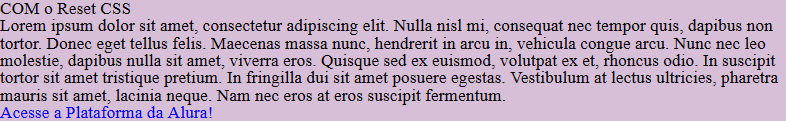
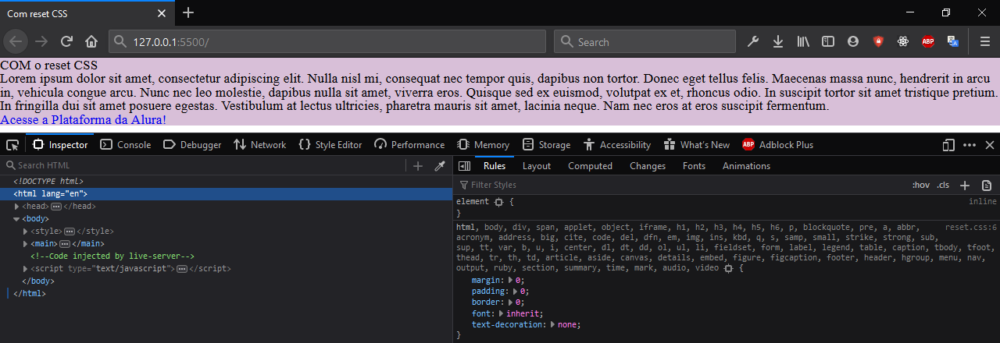

**Afinal, o que é o reset.css?**

Cada browser tem a sua apresentação por padrão, esse comportamento individual de cada browser pode gerar conflitos de layout diante do seu projeto web. E isso era um problema enfretado por programodores Front-end. Apesar de ser uma técnica *simples*, chegar em concenso mínimo sobre como "forçar" todos os browsers se comportarem igualmente, não foi fácil. Em 2007, o Eric Meyer (iremos falar mais a frente dele) em seu blog, levantou a discussão de como lidar com essas incosistências dos browsers e gerou uma grande discussão, vale a pena dar uma lida, aqui. [http://meyerweb.com/eric/thoughts/2007/04/18/reset-reasoning/]

Essas inconstâncias em que os navegadores tem no momento de rendenrizar os elementos, que  podem ser sutis ou mais grosseiras, como por exemplo, medidas diferentes para o margin superior e inferior em títulos ou a altura da linha padrão - o que poderá afetar profundamente as alturas dos elementos, alinhamentos, etc. Segue exemplo de como o reset css se comporta quando usado:

*comResetCSS*


*semResetCSS*


Conseguimos observar grandes diferenças do que o reset css pode fazer com o layout. Resetamos tags que tinham valores iniciais o que ocasionava uma pré formatação e nos retornava um estilo básico, como nas tags *h1*, *a*, *body*, etc. 

A técnica do reset css é uma forma de mitigar essas diferenças e padronizar a estilização, sobrepondo a formatação original do browsers com uma folha de estilo. Assim, o reset css se tornou uma arquivo quase que obrigatório em cada projeto web que tem por aí.

**E como usar?**

Já sabemos que se trata de uma folha de estilo que aplica estilização aos elementos HTML. E como uma folha de estilo, pode-se ser usada como normalmente é utilizada folhas de estilo em um projeto web, seja dentro do arquivo HTML, seja num arquivo externo (e que poderá ser acessado por todo os demais arquivos).

O mais habitual é que antes de se começar a estilizar o projeto, o arquivo reset css já seja adicionado para que a estilização que será feita baseada na remoção da formatação original dos browsers. Pois caso o Reset CSS for adicioado no meio do projeto, por exemplo, pode gerar dores de cabeça já que o layout foi criado utilizando como referência a formatação dos navegadores e não na *padronização* dos elementos que foram *resetados*.

**Como criar o Reset CSS?**

Compreendemos que para mitigarmos as formatações originais entre diferentes navegadores, precisamos selecionar todas as tags e adicionar sobre elas os resets, como margin, padding, border, etc. 

Cada um pode criar o seu próprio reset css a partir da necessidade do seu projeto ou pode também utilizar algum reset pronto que tenha na web, e que são alguns. Um dos mais utilizados e conheciedos foi desenvolvido pelo Eric Meyer, em blog ele explica um pouco sobre a técnica, como desenvolveu o seu código reset e disponibiliza para comunidade.

```
/* http://meyerweb.com/eric/tools/css/reset/ 
   v2.0 | 20110126
   License: none (public domain)
*/

html, body, div, span, applet, object, iframe,
h1, h2, h3, h4, h5, h6, p, blockquote, pre,
a, abbr, acronym, address, big, cite, code,
del, dfn, em, img, ins, kbd, q, s, samp,
small, strike, strong, sub, sup, tt, var,
b, u, i, center,
dl, dt, dd, ol, ul, li,
fieldset, form, label, legend,
table, caption, tbody, tfoot, thead, tr, th, td,
article, aside, canvas, details, embed, 
figure, figcaption, footer, header, hgroup, 
menu, nav, output, ruby, section, summary,
time, mark, audio, video {
	margin: 0;
	padding: 0;
	border: 0;
	font-size: 100%;
	font: inherit;
	vertical-align: baseline;
}
/* HTML5 display-role reset for older browsers */
article, aside, details, figcaption, figure, 
footer, header, hgroup, menu, nav, section {
	display: block;
}
body {
	line-height: 1;
}
ol, ul {
	list-style: none;
}
blockquote, q {
	quotes: none;
}
blockquote:before, blockquote:after,
q:before, q:after {
	content: '';
	content: none;
}
table {
	border-collapse: collapse;
	border-spacing: 0;
}
```
Veja que ele divide as tags em grupos que devem receber valores genéricos, como `margin: 0` , `border: 0` , `padding: 0` e outras que precisam de valores mais específicos, como 
```
ol, ul {
	list-style: none;
}
```
em que ele retira o estilo padrão da tag que utiliza circulos nos destaque dos itens de lista não odernada.

Há formas simplicadas também que, particularmente, utilizo mais em meus projetos, como o uso de seletores universais:
```
*, 
*:after,
*:before {
	margin: 0;
	padding: 0;
	box-sizing: border-box;
    text-decoration: none;
}
body{
    font-size: 100%;
    list-style-type: none;
}
```
Assim, ao passo da necessidade de adicionar valores à propriedades, pode adicionar.

**Como utilizar?**